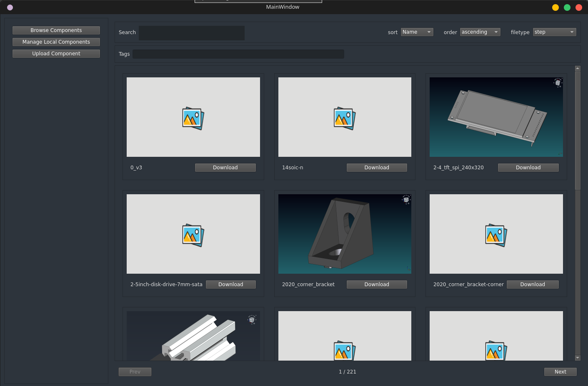

# Component Library Plugin

## Project Description:
The Component Library Plugin is a PySide6 application designed to enhance FreeCAD's capabilities by providing a user-friendly interface for managing FreeCAD models from various repositories. This plugin integrates with the Component Management System backend API to seamlessly access, download, and insert components into FreeCAD documents.

## 	Features
1. Browse and preview components available in the online repository.
2. Download and manage individual components for local use.
3. Add and manage user-specific models in the local library.
4. Insert downloaded components directly into FreeCAD documents.(yet to implement)
5. Upload components to **[Component Management System](https://github.com/FreeCAD/FreeCAD-Component-Management-System)** for public access.

## Setup
1. Clone the repository: `git clone [repository URL]`
2. Navigate to the project directory: `cd Component_Library_Plugin`
3. Install dependencies using Poetry: `poetry install`
4. Run App: `python app.py`

## Dependencies
1. python = ">=3.10,<3.12"
2. PySide6 = "^6.5.1.1"
3. certifi = "^2023.5.7"
4. python-dotenv = "^1.0.0"

## Development TODOs:

1. [ ] Add downloaded components to document
	1. [x] add to document button
	1. [x] add functionality to insert component to the active FreeCAD document
	1. [ ] BUG: only able to add step files. all other files gives error
1. [x] new window every time we go to the workbench
1. [x] upload path default to the user_dir
1. [x] change upload dialog to a widget in the main window
1. [ ] test upload
1. [ ] BUG: resolve remove attribute button error
1. [x] remove download button from grid view item
1. [ ] UI updates
	1. [ ] add user profile section
	1. [ ] ui revamp (responsive ui, proper scaling)
1. [ ] Manage configurations
	1. [ ] managing configs with freecad parameters
	1. [ ] add configurations to the backend
